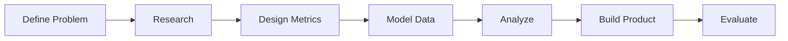

# Strength Intelligence MkII — Project Case Study

## One-Sentence Summary

I designed and built a product analytics system that combines Apple Health and workout journal data to explain resistance-training performance and support better training decisions.

## Why This Project Is Personal

This project is based on my own strength-training routine and the way I already collect health and workout data.

I am using it as a practical environment to learn and experiment with AI toward a real health goal. That personal connection matters because I am not manufacturing a problem for a portfolio. I am trying to understand a problem I repeatedly experience.

I also want to be transparent: this is an exploratory project, not a clinically validated system. The value of the work is in the process of asking better questions, building clear measurement systems, testing ideas, and learning where AI is useful or unreliable.

## Problem

Workout trackers show sets and reps. Health platforms show sleep and activity. The user is left to connect the two manually.

## Goal

Create a focused product that turns fragmented data into understandable answers:

- What changed?
- Why might it have changed?
- What should the user consider doing next?

## My Role

- Product strategy
- Research planning
- Metric design
- Data modeling
- SQL analysis
- Python analysis
- AI recommendation design
- Information architecture
- Frontend development

## Process

## Main Deliverables

- Product requirements
- KPI framework
- Research plan
- Experiment design
- Data model
- SQL progression analysis
- Python session analysis
- AI recommendation framework
- Frontend overview component
- Methodology and limitations

## Main Lesson

The most useful product is not the one with the most data. It is the one that helps the user understand what matters and make a better decision.

## How I Would Explain It

> I treated Strength Intelligence like a small product team rather than a coding exercise. I started with a user problem, defined measurable outcomes, designed the data model, wrote the analysis, translated the findings into product recommendations, and built a frontend that makes those recommendations understandable.
