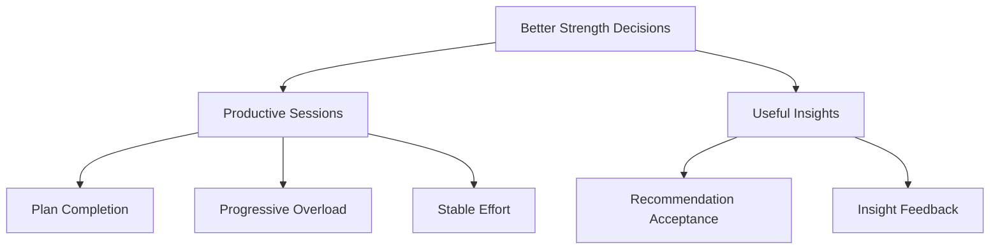

# KPI Framework

The product needs metrics that are simple enough to understand and useful enough to guide decisions.

## North Star Metric

### Productive Training Sessions

A productive session is one where the user:

- Completes the planned workout
- Maintains or improves target performance
- Avoids a large increase in effort for the same work

This metric connects adherence, progression, and session quality.

## Core Product Metrics

| Metric | Meaning | Example Calculation |
|---|---|---|
| Plan Completion | How much of the planned workout was completed | completed sets / planned sets |
| Progressive Overload Rate | How often an exercise improves | improved sessions / eligible sessions |
| Session Performance Score | Performance compared with recent baseline | current estimated performance / rolling baseline |
| Training Consistency | How reliably sessions are completed | completed sessions / planned sessions |
| Insight Usefulness | Whether recommendations help | positive feedback / rated insights |

## Guardrail Metrics

These prevent the product from optimizing the wrong behavior.

- Unplanned training interruptions
- Large increases in session effort
- Repeated failed reps
- Excessive weekly volume changes
- Low-confidence recommendations presented as certain

## Measurement Tree

