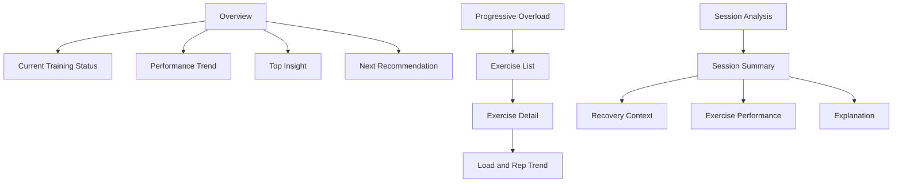

# Information Architecture

## Navigation

```text
Strength Intelligence
├── Overview
├── Progressive Overload
├── Fueling
├── Session Analysis
├── Insights
└── Methodology
```

## Screen Layout



## Design Principles

### 1. Show the answer first

The user should see the main finding before seeing the supporting chart.

### 2. Reveal evidence on demand

Every insight should allow the user to inspect the sessions and metrics behind it.

### 3. Keep confidence visible

Use plain labels:

- Low confidence
- Moderate confidence
- High confidence

### 4. Avoid dashboard overload

A small number of meaningful metrics is better than dozens of disconnected charts.

## Example Insight Card

```text
┌─────────────────────────────────────────────┐
│ PROGRESSIVE OVERLOAD                        │
│                                             │
│ Incline Dumbbell Press is ready to progress │
│                                             │
│ Last 3 sessions: 80 lb × 8, 8, 9            │
│ Average RPE: 8.1                            │
│ Recovery context: Near baseline             │
│                                             │
│ Recommendation: Try 85 lb                   │
│ Confidence: Moderate                        │
└─────────────────────────────────────────────┘
```
