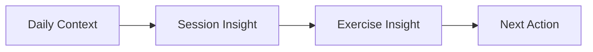

# Product Insight Brief

## Observation

Workout and health data are valuable, but the user should not need to interpret every chart manually.

## Example Finding

In the sample analysis, higher sleep duration is associated with:

- Better plan completion
- Higher session performance
- Lower session effort

## Why This Matters

A general daily score may not be enough. The effect of sleep can differ across exercises and training days.

For example:

- Heavy lower-body sessions may be more sensitive to poor sleep.
- Isolation exercises may show little difference.
- A user's personal baseline may matter more than a fixed sleep target.

## Product Recommendation

Show insights at three levels:

### Daily Context

“Sleep was below your usual range.”

### Session Insight

“Lower-body sessions after similar nights averaged lower completion.”

### Exercise Insight

“Squat performance was most affected.”

### Next Action

“Maintain today’s load instead of progressing.”

## Success Check

The insight is successful when the user can understand:

1. What changed
2. What data supports it
3. What action to consider
4. How certain the system is
