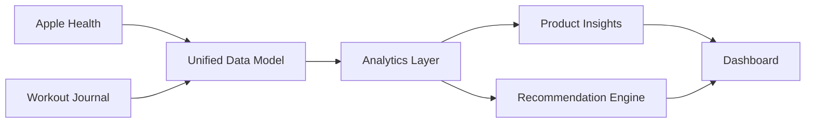
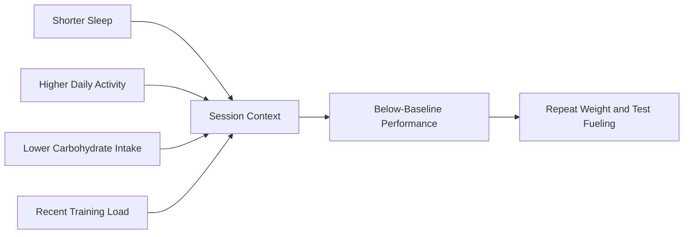

# Strength Intelligence 

Strength Intelligence is an **AI exploration project** focused on strength and resistance training.

I am building it to learn how AI, product analytics, health data, and frontend development can be used toward a real personal health goal:

> Understanding what helps me train better, recover better, and make more informed strength-training decisions.

This is not presented as a finished medical product, a validated coaching system, or a replacement for professional guidance. It is a transparent experiment in applying AI and data analysis to a problem I genuinely care about.

## Repository Guide

Strength Intelligence is organized as a living product case study. Each document explores a different part of the product, research, analytics, and system design.

| Document | Description |
|---|---|
| [Case Study](./Portfolio/Project_Case_Study.md) | Overview of the problem, approach, current progress, limitations, and lessons learned. |
| [Product Vision](./Vision/Product_Vision.md) | Long-term product direction, intended user experience, and future capabilities. |
| [Product Requirements](./Product/Product%20Strategy/Product_Requirements.md) | Product goals, user needs, requirements, success metrics, and scope. |
| [Measurement Framework](./Product/Product%20Analytics/KPI_Framework.md) | Primary outcomes, supporting metrics, guardrails, and measurement logic. |
| [Data Model](./Technical/Data/Data_Model.md) | Proposed entities, relationships, schemas, and data definitions. |
| [Analytics](./Product/Product%20Analytics/KPI_Framework.md) | Planned SQL, Python, longitudinal analyses, and experiment concepts. |
| [AI Framework](./Technical/AI/Recommendation_Logic.md) | Recommendation logic, context design, uncertainty handling, and AI evaluation. |
| [Research](./Research/Research/Research_Plan.md) | Supporting evidence, research questions, assumptions, and limitations. |
| [Design](./Product/Product%20Design/Information_Architecture.md) | Interface direction, information architecture, and product interaction decisions. |

## Why I Built This

I have trained consistently for years and already collect useful information across different tools.

My current data comes from:

- **Apple Health**, which includes sleep, steps, heart rate, activity, body weight, and nutrition data imported from connected apps
- **My workout journal**, where I would record exercises, sets, reps, weight, effort, and session notes (currently not updated nor available)

The problem is that these sources remain disconnected.

I may know that I slept less, ate fewer carbohydrates, walked more than usual, and had a weaker workout. But I still have to decide:

- Which factors actually mattered?
- Is this a real pattern or a one-time event?
- Should I progress, repeat, or adjust the next session?
- What should I test next?

My journal tells me what happened in the gym. Apple Health gives me context about sleep, activity, recovery, and nutrition. I still have to manually decide whether those signals affected my performance.

Strength Intelligence explores whether these data sources can be combined into something more useful.

## Personal Background

I am personally interested in the intersection of:

- Strength training
- Human performance
- Health technology
- Product development
- Data analysis
- AI-assisted decision-making

This project is grounded in my own routine and questions.

I want to understand things such as:

- Why are some workouts noticeably stronger than others?
- Is my sleep affecting specific lifts?
- Is a calorie deficit limiting progression?
- When should I increase weight?
- When should I repeat a session?
- Which recovery and nutrition patterns are actually useful for me?

Because the project uses a real problem from my own life, it gives me a practical environment for learning product analytics, research, data science, systems design, frontend development, and AI product development.

## Project Goal

The goal is not to create another workout tracker.

The goal is to explore how disconnected health and workout data can be turned into:

1. Clear measurements
2. Understandable insights
3. Transparent recommendations
4. Better questions for future research

Phase 1: 
- Problem framing
- Data audit
- Product requirements
- Prototype UI
- Measurement framework

Phase 2:
- Workout logging system
- Structured Notion database
- Apple Health import
- Initial analytics

Phase 3:
- Longitudinal analysis
- Insight validation
- Recommendation engine

Phase 4:
- User testing
- Additional data sources
- AI evaluation

## Project Flow

## What This Project Demonstrates

| Area | What is shown |
|---|---|
| Product | Problem framing, product requirements, roadmap |
| Analytics | Metrics, KPIs, SQL, dashboards |
| Data Science | Exploration, prediction, time-series thinking |
| Research | User questions, evidence review, limitations |
| Systems | Data flow, architecture, interfaces |
| AI | Context building and recommendation logic |
| Frontend | Visual product experience and component planning |

## Data Sources

1. **Apple Health** for sleep, activity, body weight, heart rate, nutrition, and recovery context.
2. **Workout Journal** for exercises, sets, reps, weight, effort, and session notes.

## Main Product Areas

- Overview
- Progressive Overload
- Fueling
- Session Analysis
- Insights
  

## Example Insight

Imagine that a lower-body workout performs below its recent baseline.

A normal workout tracker may only show the completed exercises, sets, reps, and weight.

Strength Intelligence adds context:

The product might explain:

Performance was below your recent baseline. This session followed shorter sleep, higher activity, and a longer period without food. These factors may have contributed, but one session does not prove causation.

It could then recommend:

Repeat the planned weight next session and test a carbohydrate-containing meal 60–120 minutes before training.

The goal is not to present the recommendation as a fact.

The goal is to turn the available evidence into a reasonable next test.

## AI Learning Focus

This project gives me a structured way to experiment with:

- Using AI to organize and explain personal health data
- Separating deterministic calculations from AI-generated language
- Designing prompts that use real user context
- Testing how useful AI-generated recommendations feel
- Understanding where AI is helpful and where it is unreliable
- Communicating uncertainty clearly
- Building responsible health-related AI experiences

## Important Transparency

The current project has several limitations:

- It begins with one primary user: me
- Some data is self-reported
- Strength workouts were recorded inconsistently in a note-based journal
- Exercise, set, repetition, load, and effort data are not complete enough for reliable longitudinal conclusions
- Historical health signals cannot be used to claim strength progression without a consistent performance outcome
- Personal patterns may not generalize to other people
- Observational relationships do not prove causation
- AI-generated explanations can be wrong
- Recommendations require further testing and validation

These limitations are part of the project, not something I want to hide.

## Current Status & Next Iteration

This repository is intentionally built in public. Rather than generating synthetic long-term results, each iteration reflects real product development, real data collection, and continuous refinement of the measurement system.

Below is a current mobile interface prototype and UI/UX direction. Currently still in development and planning. This serves as a rough idea of how a future established app would look and feel for this intended purpose.

