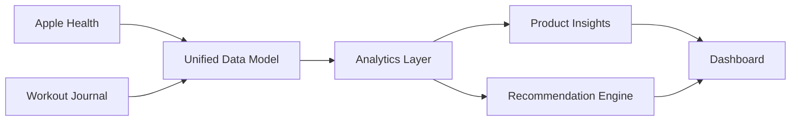

# Strength Intelligence MkII

Strength Intelligence MkII is an **AI exploration and learning project** focused on strength and resistance training.

I am building it to learn how AI, product analytics, health data, and frontend development can be used toward a real personal health goal:

> Understanding what helps me train better, recover better, and make more informed strength-training decisions.

This is not presented as a finished medical product, a validated coaching system, or a replacement for professional guidance. It is a transparent experiment in applying AI and data analysis to a problem I genuinely care about.

## Why I Built This

I have trained consistently for years and already collect useful information across different tools.

My current data comes from:

- **Apple Health**, which includes sleep, steps, heart rate, activity, body weight, and nutrition data imported from connected apps
- **My workout journal**, where I record exercises, sets, reps, weight, effort, and session notes

The problem is that these sources remain disconnected.

My journal tells me what happened in the gym. Apple Health gives me context about sleep, activity, recovery, and nutrition. I still have to manually decide whether those signals affected my performance.

Strength Intelligence explores whether these data sources can be combined into something more useful.

## Personal Background

I am personally interested in the intersection of:

- Strength training
- Human performance
- Health technology
- Product development
- Data analysis
- AI-assisted decision-making

This project is grounded in my own routine and questions.

I want to understand things such as:

- Why are some workouts noticeably stronger than others?
- Is my sleep affecting specific lifts?
- Is a calorie deficit limiting progression?
- When should I increase weight?
- When should I repeat a session?
- Which recovery and nutrition patterns are actually useful for me?

Because the project uses a real problem from my own life, it gives me a practical environment for learning product analytics, research, data science, systems design, frontend development, and AI product development.

## Project Goal

The goal is not to create another workout tracker.

The goal is to explore how disconnected health and workout data can be turned into:

1. Clear measurements
2. Understandable insights
3. Transparent recommendations
4. Better questions for future research

## Project Flow

## What This Project Demonstrates

| Area | What is shown |
|---|---|
| Product | Problem framing, product requirements, roadmap |
| Analytics | Metrics, KPIs, SQL, dashboards |
| Data Science | Exploration, prediction, time-series thinking |
| Research | User questions, evidence review, limitations |
| Systems | Data flow, architecture, interfaces |
| AI | Context building and recommendation logic |
| Frontend | Visual product experience and component planning |

## Data Sources

1. **Apple Health** for sleep, activity, body weight, heart rate, nutrition, and recovery context.
2. **Workout Journal** for exercises, sets, reps, weight, effort, and session notes.

## Main Product Areas

- Overview
- Progressive Overload
- Fueling
- Session Analysis
- Insights
- Methodology
- Sleep and Environment Intelligence

## AI Learning Focus

This project gives me a structured way to experiment with:

- Using AI to organize and explain personal health data
- Separating deterministic calculations from AI-generated language
- Designing prompts that use real user context
- Testing how useful AI-generated recommendations feel
- Understanding where AI is helpful and where it is unreliable
- Communicating uncertainty clearly
- Building responsible health-related AI experiences

## Important Transparency

The current project has several limitations:

- It begins with one primary user: me
- Some data is self-reported
- Personal patterns may not generalize to other people
- Observational relationships do not prove causation
- AI-generated explanations can be wrong
- Recommendations require further testing and validation

These limitations are part of the project, not something I want to hide.

## Current Status

This repository is a working product case study and learning environment. It includes real product thinking, example queries, starter analysis code, system diagrams, frontend specifications, and an honest record of assumptions and limitations.

## Sleep and Environment Extension

The project also explores how sleep quality, temperature, and the physical sleep environment may affect next-day resistance-training performance.

This extension connects the project to a broader product question:

How can connected health data and hardware-informed signals improve recovery and training decisions?

