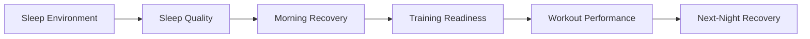
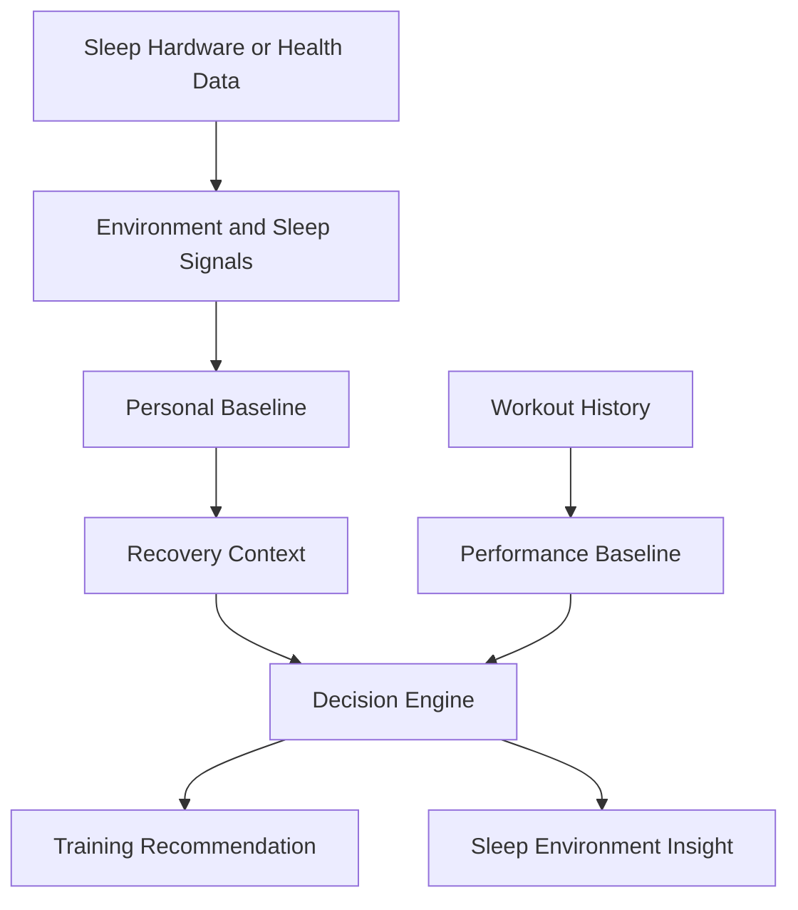

# Sleep and Environment Intelligence

## Why This Belongs in Strength Intelligence

Strength performance does not begin when a workout starts.

The quality of a training session can be influenced by what happened the night before, including:

- Sleep duration
- Sleep consistency
- Bedtime and wake time
- Nighttime heart rate
- HRV
- Room temperature
- Bed temperature
- Sleep interruptions
- Recovery after hard training

This folder explores how sleep and the surrounding environment may affect resistance-training performance.

The goal is not to turn Strength Intelligence into a general sleep product.

The goal is to understand one focused question:

> How do sleep quality and the sleep environment affect strength performance the next day?

## Product Opportunity

Most workout tools begin with the workout.

A stronger product can begin earlier:



This creates a full feedback loop between:

- Nighttime recovery
- Daily readiness
- Training decisions
- Workout outcomes
- Future recovery

## Relevant Data

### Current Signals

These can come from Apple Health or connected health sources:

- Sleep duration
- Sleep start and end time
- Resting heart rate
- HRV
- Respiratory rate
- Wrist temperature, when available
- Sleep interruptions
- Daily activity
- Workout load

### Future Environmental Signals

These could come from connected hardware or smart-home systems:

- Bed temperature
- Room temperature
- Humidity
- Noise
- Light exposure
- Cooling or heating schedule
- Time required to fall asleep
- Temperature changes during the night

## Main Product Questions

1. Do stronger workouts follow more consistent sleep?
2. Are heavy lower-body sessions more sensitive to poor sleep?
3. Does nighttime temperature relate to sleep continuity?
4. Does sleep after a high-volume session differ from normal sleep?
5. Can training recommendations account for both recovery and environment?
6. Can the system identify an ideal sleep environment for specific users?

## Example Analysis

### Question

Does a cooler sleep environment relate to better next-day session performance?

### Inputs

- Room or bed temperature
- Sleep duration
- Sleep interruptions
- HRV
- Resting heart rate
- Next-day workout performance

### Output

```text
Sleep Environment: Cooler than personal average
Sleep Duration: 7.6 hours
Interruptions: Lower than usual
Next-Day Performance: 6% above baseline

Possible Insight:
Your strongest lower-body sessions have followed cooler,
less interrupted nights.

Confidence: Low to Moderate
Reason: Limited number of temperature-linked sessions
```

## Example Feature

### Recovery-to-Performance Timeline

```mermaid
timeline
    title Sleep-to-Strength Timeline
    10:30 PM : Bed cooling begins
    11:05 PM : Sleep begins
    2:10 AM : Temperature adjusted
    6:45 AM : Wake
    7:00 AM : Recovery baseline calculated
    5:30 PM : Lower-body workout
    6:45 PM : Session performance recorded
```

The user would be able to review the full sequence instead of seeing sleep and training as separate events.

## Hardware-Aware Recommendation Example

### Finding

The user slept for a normal duration, but experienced more interruptions and a higher nighttime heart rate after a warmer night.

### Training Recommendation

Maintain the planned load, but avoid a progression attempt on the most demanding compound lift.

### Sleep Recommendation

Review the temperature pattern and compare it with recent high-quality nights.

### Why This Is Useful

The system connects a nighttime condition to a daytime decision without pretending that one signal proves the cause.

## Product Metrics

| Metric | Meaning |
|---|---|
| Sleep Consistency | Stability of sleep and wake timing |
| Sleep Continuity | How uninterrupted the night was |
| Temperature Stability | How stable the sleep environment remained |
| Recovery Change | Difference from the user's personal baseline |
| Next-Day Performance | Workout performance relative to recent sessions |
| Recovery-to-Performance Link | Strength of the relationship between nighttime and training signals |

## Experiment Ideas

### Experiment 1: Temperature and Sleep Continuity

**Hypothesis:** A cooler and more stable sleep environment is associated with fewer sleep interruptions.

### Experiment 2: Sleep Consistency and Strength

**Hypothesis:** More consistent sleep timing is associated with better plan completion and lower session effort.

### Experiment 3: Training Load and Nighttime Recovery

**Hypothesis:** High-volume training days are followed by measurable changes in nighttime heart rate, HRV, or temperature.

### Experiment 4: Adaptive Training Recommendations

**Hypothesis:** Recommendations that include sleep and environment context are more useful than recommendations based only on workout history.

## Systems Connection



## Important Limitation

Environmental and physiological signals can be related without one directly causing the other.

This part of the project should remain exploratory until:

- Enough data has been collected
- Measurements are reliable
- Confounding factors are considered
- Patterns repeat over time
- Recommendations are tested safely

## Why This Strengthens the Project

This folder shows that Strength Intelligence can connect:

- Software
- Health data
- Physical environments
- Connected hardware
- Product analytics
- Human performance

It expands the project beyond workout tracking while keeping the story focused on strength and recovery.
