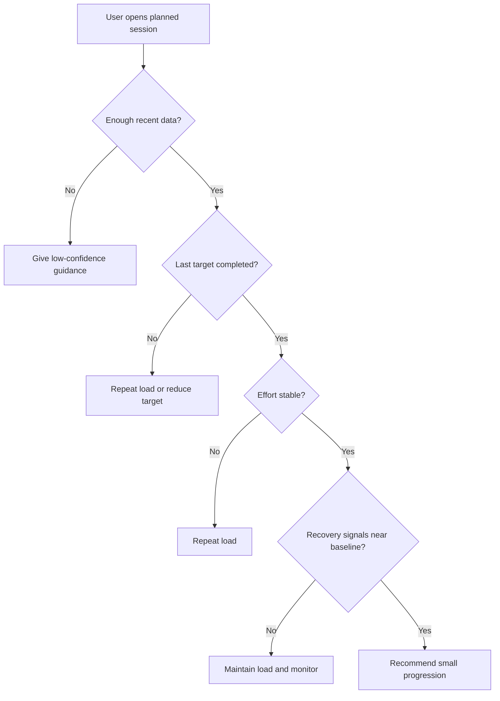

# Recommendation Logic

The AI layer should explain the analysis, not invent conclusions.

## Inputs

- Recent exercise performance
- Planned workout
- Sleep duration
- HRV trend
- Resting heart rate trend
- Recent training load
- Set completion
- RPE
- Body-weight trend

## Decision Flow

## Example Rule

A load increase may be recommended when:

- The previous target was completed
- Average set RPE did not rise sharply
- The exercise has not regressed over recent sessions
- Recovery signals are not meaningfully below baseline
- The user has enough history for comparison

## Example Output

### Recommendation

Increase incline dumbbell press from 80 lb to 85 lb for the first working set.

### Why

- Target reps were completed in the last two sessions.
- Average RPE remained below 8.5.
- Recent sleep was near your normal range.
- No short-term decline was detected.

### Confidence

Moderate

### Limitation

The system does not currently use bar velocity, soreness, or injury data.

## AI Safety Rule

The model must never present a health or injury conclusion as a diagnosis. It should direct users to qualified professionals when symptoms, pain, or medical concerns are involved.
