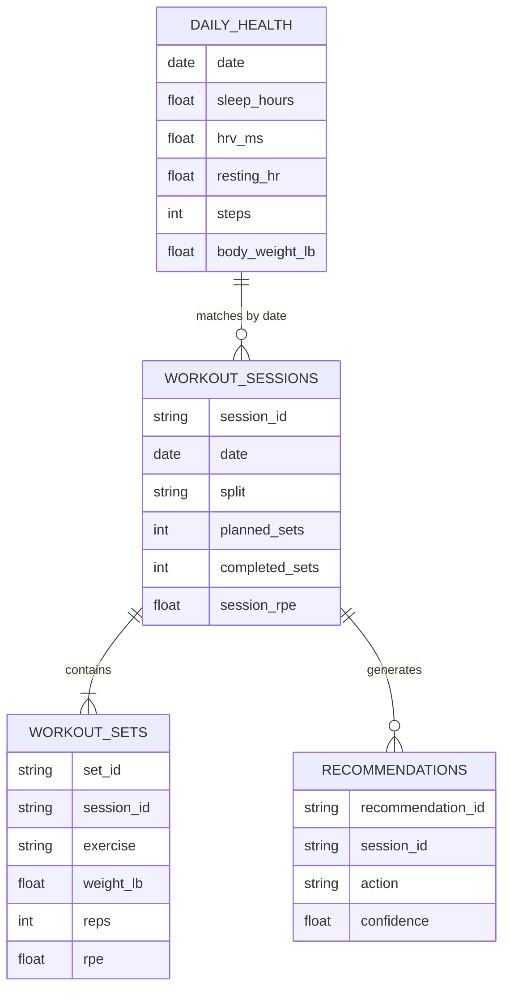

# Data Model

## Main Tables

### daily_health

One row per calendar day.

| Column | Type | Description |
|---|---|---|
| date | date | Calendar date |
| sleep_hours | float | Total sleep duration |
| resting_hr | float | Resting heart rate |
| hrv_ms | float | Heart-rate variability |
| steps | integer | Daily steps |
| active_energy_kcal | float | Active energy |
| body_weight_lb | float | Body weight |

### workout_sessions

One row per workout.

| Column | Type | Description |
|---|---|---|
| session_id | text | Unique workout ID |
| date | date | Workout date |
| split | text | Push, pull, legs, upper, lower |
| duration_min | integer | Session length |
| planned_sets | integer | Planned working sets |
| completed_sets | integer | Completed working sets |
| session_rpe | float | Overall session effort |
| notes | text | Journal notes |

### workout_sets

One row per working set.

| Column | Type | Description |
|---|---|---|
| set_id | text | Unique set ID |
| session_id | text | Parent workout |
| exercise | text | Standardized exercise name |
| set_number | integer | Order within exercise |
| weight_lb | float | External load |
| reps | integer | Completed reps |
| rpe | float | Set effort |
| is_failure | boolean | Whether the set reached failure |

## Relationships

