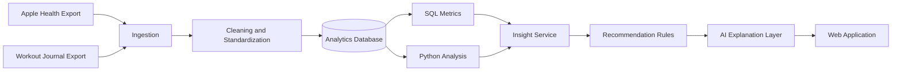
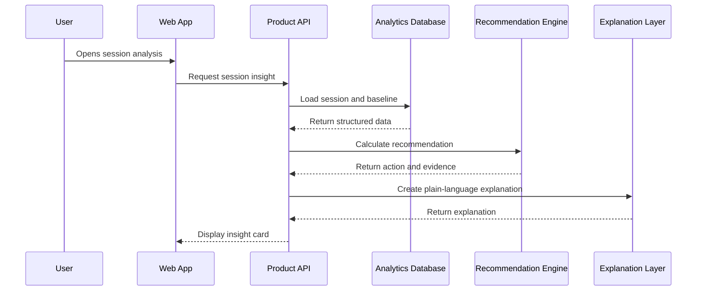

# System Architecture

## Purpose

The systems layer explains how information moves from raw data to a user-facing recommendation.

## High-Level Architecture



## Main Components

### 1. Ingestion

Reads exported Apple Health and workout journal data.

### 2. Cleaning

- Standardizes dates
- Removes duplicates
- Normalizes exercise names
- Checks missing values
- Converts units

### 3. Analytics Database

Stores structured daily health, workout, set, metric, and recommendation records.

### 4. Metric Layer

Provides consistent definitions for:

- Session performance
- Plan completion
- Progressive overload
- Recent training load
- Personal recovery baseline

### 5. Insight Service

Finds patterns and creates structured findings.

Example:

```json
{
  "insight_type": "sleep_performance",
  "exercise": "Barbell Squat",
  "effect": -0.07,
  "confidence": "moderate",
  "supporting_sessions": 14
}
```

### 6. Recommendation Layer

Maps findings to cautious actions such as:

- Progress load
- Repeat load
- Reduce planned volume
- Review recovery
- Collect more data

### 7. Explanation Layer

Turns structured findings into clear language. It does not calculate the core metrics itself.

## System Design Principle

> Calculations should be deterministic. AI should explain the result, not invent it.

## Request Flow


