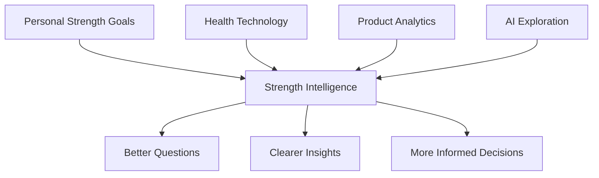

# Personal Background

## Why This Problem Matters to Me

Strength Intelligence is not a random concept or project.

It comes directly from how I currently manage my own training and health.

I consistently track:

- Weight-training sessions
- Exercises, sets, reps, and load
- Sleep
- Steps and daily activity
- Calories and macros
- Body weight
- Recovery-related health signals
- Notes about how sessions feel

Most of this information already exists, but it lives across different systems.

Apple Health contains much of my broader health context. My workout journal contains the detailed resistance-training data that Apple Health does not fully capture.

I often have enough data to know that something changed, but not enough structure to understand why.

For example:

- A workout feels unusually weak
- A lift stops progressing
- A higher-volume week feels harder than expected
- Sleep changes before a heavy session
- Body weight drops while strength stalls
- A specific meal or workout time seems to improve performance

These are exactly the types of questions I want to explore.

## My Motivation

I am genuinely interested in strength training, human performance, and health technology.

I want to learn how products can move beyond simply collecting data and help people understand what that data means.

This project allows me to combine several areas I care about:

## What I Am Learning

Through this project, I am learning how to:

- Turn a personal problem into a clear product question
- Define meaningful metrics
- Organize messy health data
- Write SQL for product analysis
- Use Python for exploration and modeling
- Design frontend experiences around insights
- Build transparent AI recommendation flows
- Communicate uncertainty and limitations
- Separate evidence from speculation

## Why I Am Starting With Myself

Starting with my own data gives the project a concrete foundation.

It means I can:

- Understand the source of each data point
- Identify missing or unreliable information
- Compare recommendations with my lived experience
- Test whether the product is understandable
- Notice when the system produces something unrealistic

This does not make the findings universally valid.

It makes the first version grounded, testable, and honest.

## Long-Term Question

The broader question behind the project is:

> Can AI help people understand their own strength-training data well enough to make better decisions without pretending to replace coaches, researchers, or medical professionals?

Strength Intelligence MkII is my way of exploring that question in public.
