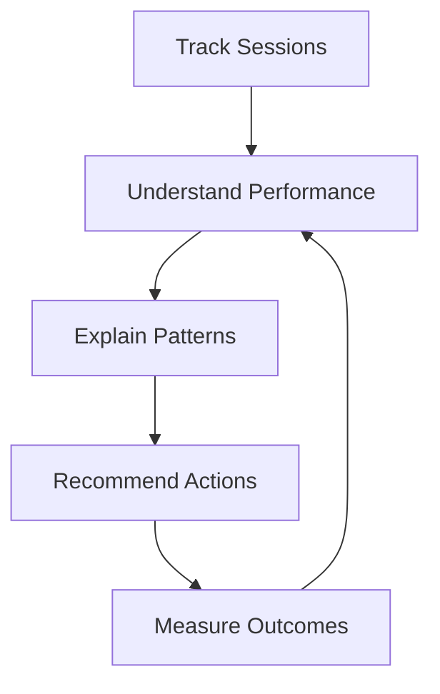

# Product Vision

## The Problem

Strength-training data is usually split across multiple tools.

A workout journal shows what happened in the gym. Apple Health shows sleep, activity, body weight, and other health signals. Neither source explains how these signals work together.

## The Product Idea

Strength Intelligence connects training performance with health context.

It should help answer questions such as:

- Why was today's workout better or worse?
- Am I progressing at a healthy rate?
- Is poor sleep affecting a specific lift?
- Should I increase weight, repeat the session, or reduce volume?
- Which behaviors are linked to my strongest workouts?

## Product Promise

> Turn disconnected health and workout data into clear strength-training decisions.

## Who It Is For

The first user is a consistent lifter who already tracks workouts and owns an iPhone or Apple Watch.

## What It Is Not

Strength Intelligence is not:

- A general health platform
- A replacement for medical advice
- A social fitness network
- A generic workout tracker
- A fully autonomous coach

It is a focused intelligence layer for resistance training.

## Long-Term Direction

